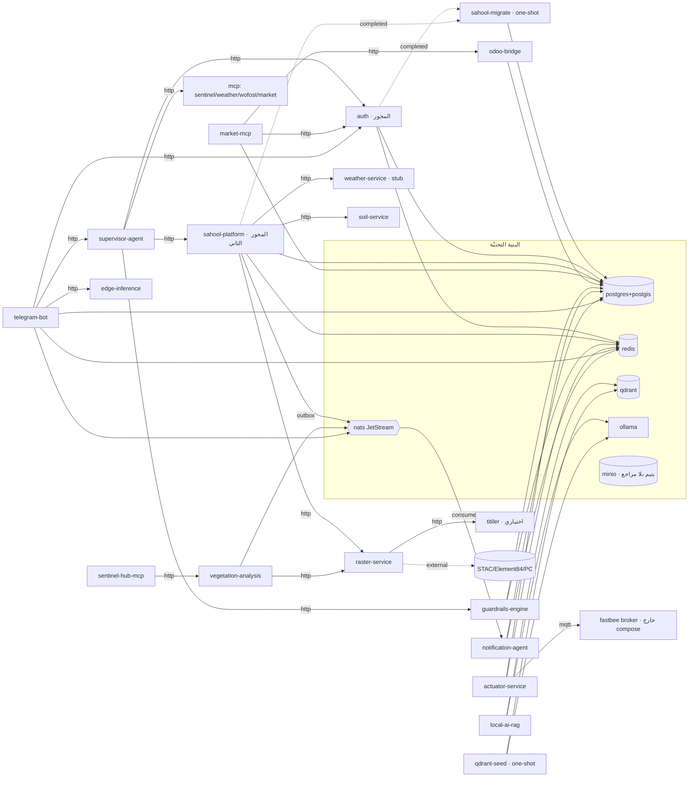

# تدقيق معماريّ: خريطة التبعيّات والفجوات وجاهزيّة الحلقة المغلقة — 2026-06

> مُشتقّ **مباشرةً من الكود** (لا الوثائق) عبر أربعة فحوص متوازية: خريطة تبعيّات
> الخدمات، جرد الفجوات المخفيّة، جاهزيّة الحلقة الزراعيّة المغلقة، وعزل المستأجِرين.
> كلّ ادّعاء مُسنَد بـ`file:line` أو مفتاح compose. الغرض: **تأسيس** بناء محرّك القرار
> المؤتمت على أرض صلبة بدل بنائه أعمى.

## خلاصة تنفيذيّة

تقييم خارجيّ حديث منح المنصّة **8.2/10** ووصف الفجوة المركزيّة بأنّها «بين جمع
البيانات ومحرّك القرار المؤتمت». **هذا التدقيق يؤكّد ذلك من الكود**، مع ثلاثة تصحيحات
مهمّة:

1. **عزل المستأجِرين أقوى ممّا قُدِّر (8/10 لا 7):** محروس بـRLS+FORCE على مستوى
   القاعدة، **ذاتيّ الشفاء للجداول المستقبليّة** (حلقات v56/v57 الديناميكيّة)،
   ومقفول بحارس CI. **لا تسرّبات في منطق الاستعلام.**
2. **stubs الطقس/المؤشّرات ليست فجوات مخفيّة** بل **قرارات تمركز مُعلَنة بصدق** —
   المنطق الفعليّ في `sahool-platform`.
3. **المُشغِّل (actuator) حقيقيّ** (أوامر MQTT موقَّعة) لا stub — لكنّه **منفصل
   معماريّاً عن محركات القرار**. هذه هي الفجوة غير المقصودة الوحيدة.

**الاستنتاج:** المنصّة على بُعد **طبقة تكامل واحدة** من القدرة على إغلاق الحلقة،
لكنّها تتوقّف قبلها عمداً (موقف أمان human-in-the-loop موثَّق) — عدا فجوة واحدة
حقيقيّة: غياب **موزِّع قرار→تنفيذ محروس** يربط المحركات↔guardrails↔actuator.

---

## ١) خريطة تبعيّات الخدمات (Service Dependency Graph)

### الرسم

### المحاور والأطراف
- **المحور الأوّل (الأكثر دخولاً): `auth`** — يناديه supervisor/market-mcp/odoo-bridge/telegram (٤ HTTP) ولا ينادي أيّ خدمة SAHOOL ← بالوعة نظيفة، بوّابة المكدّس كلّه.
- **المحور الثاني: `sahool-platform`** — الناشر الوحيد لأحداث domain، يخدم ذكاء الحقل، يخرج لـraster/weather/soil. مركز مستوى الأحداث.
- **أطراف/مستقلّة:** weather-mcp، wofost-mcp (حوسبة صرفة)، raster-service (STAC خارجيّ فقط)، guardrails-engine (وارد فقط)، edge-inference (مزامنة سحابة خارجيّة)، indicators/weather (stubs صحّيّة).

### طوبولوجيا NATS
- **ناشران:** `sahool-platform` يُصدِر `sahool.events.>` عبر **نمط outbox** الموثوق
  (`api/event_bus.py` OutboxWorker يقرأ `event_outbox` → NATS، `api/main.py:271-279`)؛
  و`vegetation-analysis` يُصدِر `sahool.tenant.{t}.satellite.{field}.computed`
  (`main.py:544-559`).
- **مستهلِك وحيد:** `notification-agent` (JetStream durable، `agent.py:332-378`) يشترك في
  `sahool.events.>` + مواضيع الآفات/الريّ/السماد/المخزون/المهام، ويفرّق لـWS/بريد/تلغرام
  معزولاً بالمستأجِر.

### ملاحظات بنيويّة (قابلة للإصلاح)
- **أهداف معلّقة في الكود غير معرّفة في `docker-compose.v9.yml`:** `sahool-fastbee`
  (MQTT للمُشغِّل)، `sahool-tts` (telegram/notification)، `sahool-erpnext`
  (مزوّد odoo-bridge الافتراضيّ، في compose منفصل)، `sahool-zlmediakit`
  (video-processor مُعطَّل). نداءات وقت التشغيل إليها تفشل ما لم تُوفَّر خارجيّاً.
- **`minio`** بنية مُعرَّفة بلا أيّ مرجع في الكود — **يتيم** (تخزين كائنات غير مُستعمَل).
- **لا دورة إقلاع** في `depends_on` (DAG)؛ ولا دورة نداء HTTP متبادلة.

---

## ٢) جاهزيّة الحلقة الزراعيّة المغلقة (Closed-Loop Autonomy)

| المرحلة | موجودة؟ | مؤتمتة أم بشريّة؟ | المرجع | الفجوة |
|---|---|---|---|---|
| **١. ملاحظة** | نعم | **مؤتمتة** (مُجدول asyncio) | `api/scheduler.py:170-186`، `main.py:238-247` | عمليّة واحدة، بلا قفل موزّع |
| **٢. قرار** | نعم | **عند الطلب فقط** (المحركات ليست على المُجدول) | `core/recommendation_engine.py`؛ التنبيهات فقط آليّة `main.py:182-236` | لا تمريرة قرار ذاتيّة؛ التوصيات تتطلّب نداء HTTP |
| **٣. حواجز** | نعم (طبقتان) | فحص نقيّ + موافقة بشريّة DB | `core/guardrails.py:51-152`؛ `guardrails-engine` + `human_in_loop.py:38-258` | **غير موصولة بمسار المُشغِّل إطلاقاً** |
| **٤. تنفيذ** | نعم — **حقيقيّ لا stub** | مؤتمت لكن **منفصل عن القرار** | `actuator-service/main.py:97-128` (MQTT موقَّع)، `evaluate_rules:233-398` | يُطلق من `automation_rules` (عتبة مستشعر واحد) **لا يكتبها أيّ محرّك**؛ نقطة صمّام الريّ ترفض التشغيل (`routers/irrigation.py:133-135`) |
| **٥. تغذية/تعلّم** | نعم (مُعرَّفة، غير نشطة) | **يدويّ/اقتراح فقط** | `core/policy_learning.py:206-255` (يقترح لا يكتب)؛ `feedback_closure.py:319-356` | الحلقة **مفتوحة بالتصميم** |

**أدلّة:** المُشغِّل يوقّع الأوامر HMAC-SHA256 (`main.py:103-119`)، dedup + Saga
تعويضيّة — تنفيذ بدرجة إنتاج، لكنّه لا يُغذّى من المحركات. الموافقة البشريّة حقيقيّة
ومُحصَّنة (`approval_workflows`، `SELECT … FOR UPDATE`، طبقات MEDIUM/HIGH/CRITICAL،
انتهاء 48س) لكنّها في `guardrails-engine` الذي **لا يناديه أيّ مسار مؤتمت**. والتعلّم
يرفض التطبيق الآليّ صراحةً (`policy_learning.py:206`: «لا تُطبَّق آليّاً أبداً»).

### ما ينقص لإغلاق الحلقة بأمان (مرتّب)
1. **موزِّع قرار→تنفيذ بحاجز إلزاميّ (الحلقة المفقودة المركزيّة):** خدمة/عامل يأخذ
   توصية محرّك → يشغّل `guardrails.check_guardrails()` + `guardrails-engine /evaluate`
   → عند `allowed` فقط يترجمها إلى صفّ `automation_rules` أو `actuator POST /command`.
   **لا يوجد مسار كهذا.**
2. **وصل `guardrails-engine` بالمُشغِّل:** `evaluate_rules` و`POST /command` بلا أيّ
   نداء حاجز — أيّ عتبة رقميّة تُطلق MQTT. أضِف نداءً قبل النشر (PHI/ملوحة/طبقات
   اقتصاديّة) فترث الأوامر الفيزيائيّة أمان واجهة التوصية.
3. **طابور تنفيذ بموافقة:** اربط `HumanApprovalWorkflow` (جاهز DB) بالتنفيذ — توصية
   بـ`requires_human_approval` تُنشئ workflow؛ `approved` فقط يحرّر الأمر.
4. **تطبيق آليّ للسياسة المُتعلَّمة خلف علم:** `policy_learning` يُنتج `suggested_overrides`
   بشكل `AlertThresholds`؛ أضِف مساراً اختياريّاً (علم لكلّ مستأجِر + تدقيق) يكتبها حين
   `feedback_closure` يُرجِع `ready=True` (≥50 نتيجة، قبول ≥0.7).
5. **أثر تدقيق موحّد** يربط recommendation_id ← حاجز ← موافقة ← أمر ← نتيجة (مُقاسة).
   القطع موجودة لكنّها معزولة (`device_commands_log`/`approval_workflows`/`automation_ledger`).
6. **حماية تنفيذ آمنة للعنقود:** dedup حاليّاً `dict` في-العمليّة (`main.py:48-52`)
   والمُجدول أحاديّ — تحتاج idempotency مشترك (Redis/DB) + قفل قائد قبل الثقة بالإطلاق.

**الحُكم:** بعيدة عن **الاستقلال** (لا قرار→فعل→تعلّم بلا بشر)، لكن قريبة من
**القدرة** — الناقص موزِّع محروس يربط المحركات↔guardrails↔actuator + تطبيق آليّ
محروس بعلم للتعلّم المحسوب أصلاً.

---

## ٣) الفجوات المخفيّة (مُصنَّفة)

> منهجيّة المستودع **منضبطة في التدهور الصادق**: غالب الـstubs تُعلِن نفسها وتشير
> لموضع المنطق الحقيقيّ. أدناه فجوات Type B (حقيقيّة) فقط — الـstubs المُعلَنة
> (طقس/مؤشّرات/alert stub_sender/idempotency المُشغِّل) **ليست فجوات**.

| # | الفجوة الحقيقيّة | المرجع | الأثر |
|---|---|---|---|
| 1 | **مُجدول النضارة عاطل** — يمرّر `check_decision_freshness(0,0,0)` ثوابت | `api/main.py:163-164` | المهمّة الدوريّة «هل القرارات قديمة؟» **لا تكشف القِدَم أبداً**، وتبدو صحّيّة في scheduler-status |
| 2 | **طابور المزامنة دون اتّصال في-الذاكرة** (`deque` لكلّ عمليّة) | `core/offline_first.py:104-118`، `main.py:104` | عمليّات المزارع غير المُزامَنة تُفقَد عند إعادة التشغيل / لا تُرى عبر النسخ |
| 3 | **تكرار صيَغ مؤشّرات الغطاء** في ٤ مواضع | veg `main.py:463-497`؛ raster `band_math.py:23-89`؛ `pipeline.py:111-126`؛ `index_registry.py:67-160` | معالجة أصفار متباينة أصلاً؛ إصلاح في موضع يخالف الباقي بصمت |
| 4 | **نماذج ML للآفات/الغلّة خاملة في النشر النظيف** + `sha256=""` | `edge-inference/download_models.py:15-33` | القدرة معطّلة بلا ملفّات (503 صادق)؛ لا تحقّق سلامة للثنائيّات المُنزَّلة |
| 5 | **`vegetation-analysis` مقيَّد بـ`FIELD_REGISTRY` ثابت + تقديريّ لغير NDVI** | `main.py:137, 413-497` | حقول المستأجِرين الجديدة غير مرئيّة؛ كلّ مؤشّر عدا NDVI تقديريّ حتى مع صور حقيقيّة |

ملاحظة صدق: تعليق `core/jwt_denylist.py:3-9` **قديم** (يقول الربط «خطوة نشر») —
الواقع أنّه موصول فعلاً في `get_current_user` (`api/main.py:743`) بخلفيّة Redis.

---

## ٤) عزل المستأجِرين (Multi-Tenant Isolation) — **8/10**

**التغطية ذاتيّة الشفاء ومحروسة:**
- `v9_rls_tenant_isolation.sql` يُعرّف `_sahool_apply_tenant_rls(table)` = ENABLE+FORCE+سياسة
  `USING (tenant_id::TEXT = NULLIF(current_setting('app.current_tenant', true), ''))`.
- `v9_rls_force_all.sql` (متأخّر) حلقة `DO` تُجبر كلّ جدول RLS غير مُجبَر.
- `v56_rls_dynamic_all.sql` (الأخير) حلقة تُغطّي **كلّ** جدول فيه `tenant_id` وبلا سياسات
  ← تغطية تلقائيّة للجداول المنسيّة/المستقبليّة. و`v57` فهارس tenant_id للأداء.
- **الضمان الحقيقيّ = حارس CI:** `test_rls_tenant_coverage.py` (**unit، بلا قاعدة، على كلّ PR**)
  يُفشِل الدمج إن وُجد جدول `tenant_id` غير محميّ؛ و`test_rls_isolation_negative.py`
  (integration) يؤكّد: صفر RLS-بلا-FORCE، كلّ RLS له سياسة، كلّ جدول tenant_id عليه RLS،
  والسياسات تشير لـ`current_setting` (لا `USING true` وهميّ).
- **مسار التشغيل** يضبط النطاق عبر `tenant_connection` (`main.py:332`، GUC معامليّ
  transaction-local).

**صيد التسرّبات:** فُحِص ١٨ موضع استعلام raw — **لا تسرّب في منطق الاستعلام**. كلّها إمّا
سياق-مضبوط، أو خلفيّة عابرة-بالتصميم (تعدّ المستأجِرين ثمّ تُعيد النطاق)، أو جداول بلا RLS،
أو scaffolding غير موصول (fail-closed: GUC غير مضبوط ⇒ صفر صفوف تحت `sahool_app`).

### ⚠️ أخطر مأخذ تشغيليّ: اختيار دور `DATABASE_URL`
RLS+FORCE **يُتجاوَز بالكامل** بأيّ اتّصال superuser/BYPASSRLS. يجب أن يتّصل التطبيق
بـ`sahool_app` (NOSUPERUSER NOBYPASSRLS) لا بمالك الهجرات `sahool_user`/`postgres`.
`v9.yml`/`bootstrap`/`apply_in_compose.sh`/`POSTGRES_SETUP.md` كلّها صحيحة، **لكن**:
- `docker-compose.unified.yml:36`، `docker-compose.light.yml:33`،
  `docker-compose.odoo-snippet.yml:10` تُثبّت `DATABASE_URL` على **superuser** (`postgres`) ←
  النشر عبر أيٍّ منها **يُعطّل عزل المستأجِرين بصمت** رغم صحّة كلّ السياسات.
- مثال `docker-compose.fixed.yml:11` يستخدم `sahool_user`.

**هذا أهمّ بند أمنيّ قابل للإصلاح في التدقيق كلّه** (تغيير سطر env).

---

## ٥) خارطة الأولويّات المُشتقّة (Grounded Roadmap)

مرتّبة بـ(القيمة × القابليّة الآمنة الآن):

| الأولويّة | البند | النوع | الأساس الموجود للبناء عليه |
|---|---|---|---|
| **P0** | إصلاح مُجدول النضارة العاطل (تمرير الأعمار الفعليّة) | خطأ، برمجيّ صرف | `_freshness_sweep` + `check_decision_freshness` موجودان |
| **P0** | تصحيح `DATABASE_URL` لـunified/light/odoo-snippet → `sahool_app` | أمان، سطر env | الدور يُنشأ تلقائيّاً (sahool-migrate) |
| **P1** | **موزِّع قرار→تنفيذ محروس** (الحلقة المغلقة، شريحة أولى خلف علم) | معماريّ | المحركات + guardrails + actuator + automation_ledger |
| **P1** | وصل `guardrails-engine` بمسار المُشغِّل (حاجز قبل MQTT) | أمان تنفيذ | `guardrails-engine /evaluate` + actuator |
| **P2** | وحدة صيَغ مؤشّرات مشتركة (إنهاء التكرار الرباعيّ) | جودة | `index_registry.py` كنقطة حقيقة |
| **P2** | إدامة طابور المزامنة دون اتّصال (DB/Redis بدل الذاكرة) | متانة بيانات | `offline_first` + جدول outbox القائم |
| **P3** | تطبيق آليّ للسياسة المُتعلَّمة خلف علم + تدقيق | تعلّم | `policy_learning` + `feedback_closure` |
| **P3** | حماية تنفيذ آمنة للعنقود (idempotency مشترك + قفل قائد) | تشغيل | dedup المُشغِّل الحاليّ |

**التوصية:** ابدأ بـ**P0** (إصلاحان سريعان عاليا الأثر: خطأ النضارة + ثغرة env)، ثمّ
**P1** (شريحة الموزِّع المحروس) — هي بالضبط ما يحوّل المنصّة من «جمع بيانات + تحليلات»
إلى «حلقة قرار مغلقة محروسة»، وهو ما يرفعها نحو منافسة المنصّات العالميّة.

---

*مصادر: `docker-compose*.yml`، `services/sahool-platform/api/{main,scheduler,event_bus}.py`،
`services/{actuator-service,guardrails-engine,vegetation-analysis-service,edge-inference}/`،
`core/{guardrails,policy_learning,offline_first,feedback_closure}.py`،
`migrations/{v9_rls_*,v56_*,v57_*}.sql`، `tests_v9/test_rls_*`.*
