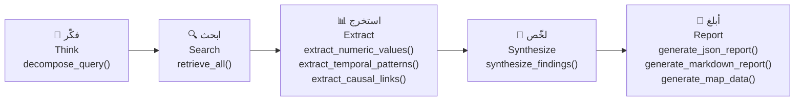

# SAHOOL — Agronomic Research Pipeline | خطّ أبحاث SAHOOL الزراعيّة

خطّ بحثي حتميّ لدعم القرار الزراعي في اليمن.  
A deterministic research pipeline for agricultural decision-making in Yemen.

---

## تدفّق العمليّات / Pipeline Flow



---

## المراحل / Stages

| # | المرحلة | Stage | الوظيفة |
|---|---------|-------|---------|
| 1 | فكّر | Think | تحليل الاستعلام → استعلامات فرعيّة |
| 2 | ابحث | Search | جلب البيانات من 5 مصادر |
| 3 | استخرج | Extract | قيم رقميّة + أنماط زمنيّة + روابط سببيّة |
| 4 | لخّص | Synthesize | عوامل + توصيات + ثقة كليّة |
| 5 | أبلغ | Report | JSON + Markdown + GeoJSON |

---

## المصادر / Data Sources

| المصدر | Source | النوع |
|--------|--------|-------|
| `sentinel_hub` | بيانات NDVI الفضائيّة | Mock |
| `weather_api` | بيانات الطقس والأمطار | Mock |
| `soil_sensors` | مستشعرات التربة (NPK، رطوبة) | Mock |
| `irrigation_logs` | سجلّات الري | Mock |
| `qdrant_rag` | قاعدة المعرفة الزراعيّة | Mock |

---

## الاستخدام السريع / Quick Start

```python
from sahool_ai.research import run_pipeline

result = run_pipeline("لماذا انخفض NDVI في القطاع الشمالي؟")
print(result["json"]["summary"])
print(result["markdown"])
```

---

## الخصائص / Features

- **حتميّة كاملة**: نفس المدخلات → نفس المخرجات دائماً.
- **عربي أوّلاً**: جميع الملخّصات والتوصيات والعوامل بالعربية.
- **قابليّة الاختبار**: جميع الموصّلات قابلة للاستبدال عبر `CONNECTORS`.
- **مقاومة الأخطاء**: نتائج جزئيّة عند فشل مصدر واحد.
- **GeoJSON صالح**: بيانات الخريطة جاهزة للعرض في أيّ تطبيق.
